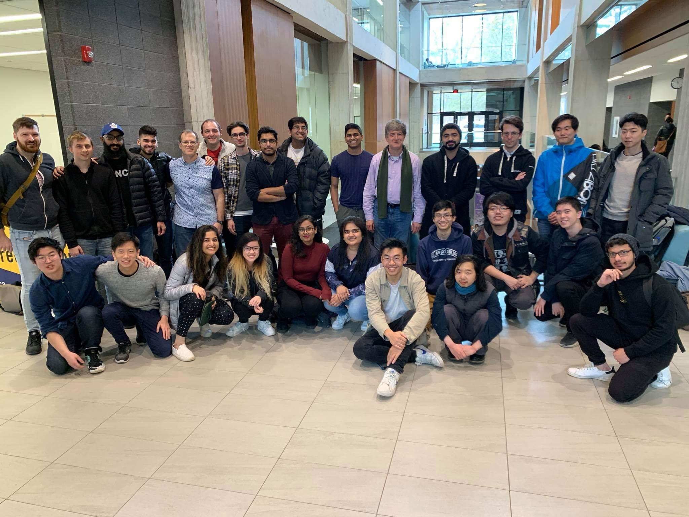

# Hacklab Roles 

## Technology Team

### Technology Director

#### Responsibilities
- Manage the hacklab website repository.
- Host office hours (with or without appointment) to provide student guidance.
- Host workshops and develop content for student success.
- Be responsive on Microsoft Teams to answer inquires about personal projects and career advice.
- Maintain and oversee the community projects.

#### Qualifications
- Passionate about technology and sharing that passion through education.
- A subject matter expert across multiple technical domains.
- Experienced with conducting technical mentorship.
- The constant drive to learn and adapt to new technology and environment

## Professional Team

### Career Success Director

##### Qualifications 
- 1+ years of experience in applying and landing internships/PEY .
- A deep understanding of  the technical interview process and what makes a strong technical resume.
- Excellent interpersonal and highly developed communication skills (verbal and written).
- Leadership acumen and expereince.
- Train associates to help support student career growth.

#### Responsibilities
- Create and advertise bookable appointment slots on the HL website for mentorship and general advice.
- Hold office hours to help students with resume critiques, career advice, and technical interview questions.
- Organize and run weekly technical interview workshops: Discuss a problem and facilitate group problem solving.
- Collaborate with the outreach director to curate an online list of career-related resources using Markdown and Vuepress (Ex [Here](https://docs.google.com/document/d/11zgd7rl9bimzh-2R4dDid7wtZui_dNIHCWQdUk23LVY/edit)).

### Outreach Director

#### Qualifications
- 1+ years of experience in applying and landing internships/PEY .
- A solid understanding of the internship and PEY process.
- Excellent interpersonal and communication  and skills (verbal and written) .
- The ability to handle multiple projects at once and prioritize effectively.
- Leadership acumen and experience.

#### Responsibilities
- Organize a timeline of events for the year that will connect students with career opportunities.
- Prepare budgets for career-related events. 
- Submit funding proposals to the department and follow up on these requests.
- Propose innovative and unique corporate partnership opportunities. 
- Handle event logistics: room booking, refreshment, gifts, etc.
- Market proposed events. 
- Curate job opportunities for students. 

## Management Team

### General Manager

#### Responsibilities
- Coordinate and facilitate initiatives from all Computer Science related entities, such as MCSS, DSC, and CS faculty
- Create innovative incentives for new members to visit the HackLab 
- Investigate the different sentiments surrounding the Computer Science Student Experience on campus and all digital platforms
Correct the direction of HackLab when necessary
- Interface with students and faculty through weekly sync ups via a report and an in-person discussion with MCS Department Chair regarding the status of the student landscape 
- Maintain a public calendar on the HackLab website, Google Calendar, and Outlook Calendar for all CS related events across different entities 
- Create opportunities to train and co-organize independent student initiatives, such as student-run workshops or looking for teammates for a project
- Collaborate on Mental Health Support Initiatives with UTM Student Resources for professional aid such as UTM Wellness.
- Interface with UTM Student Resources such as the Career Center
Co-Host events to improve student experience such as a PoST and PEY Information Session with Academic & Professional Team
- Support Operations Officer, Academic & Professional Team
- Host general inquiry feedback office hours online and on campus
#### Qualifications
- A passion and a clear vision for improving the Computer Science Student community.
- An understanding of the computer science student experience from all of its communities.
- Excellent interpersonal and highly developed communication skills (verbal and written).
- Detail-oriented: handle multiple projects at once and prioritize effectively.
- Leadership acumen and the passion to apply it to empower students in their pursuit of a tech career.
- A proven track record of one’s ability to scope workload.

### Operation Officer

#### Responsibilities
- Define, enforce and maintain a HackLab etiquette. 
- Coordinate and support General Manager, Academic & Professional Team 
- Communicate state of HackLab, initiatives and team check-ins to MCS Department.
- Maintain the HackLab website and regularly contribute new content.
- Create promotional content for Hacklab.
- Define requirements needed in order to be granted access to space. 
- Coordinate with Andrew Wang to grant/revoke student access.
- Maintain a room & equipment (VR/3D Printing) usage scheduling system.
- Write business cases, manage hacklab finances, and interface with Donna Coulson.
- Interface with UTM Resources and other departments. 
- Actively seek out collaborations with other departments outside of MCS.

#### Qualifications
- A passion and a clear vision for improving the Computer Science Student community.
- An understanding of the computer science student experience from all of its communities.
- Excellent interpersonal and highly developed communication skills (verbal and written).
- The ability to handle multiple projects at once and prioritize effectively.
- Leadership acumen and the passion to apply it to empower students in their pursuit of a tech career.
- A proven track record of one’s ability to scope workload.
