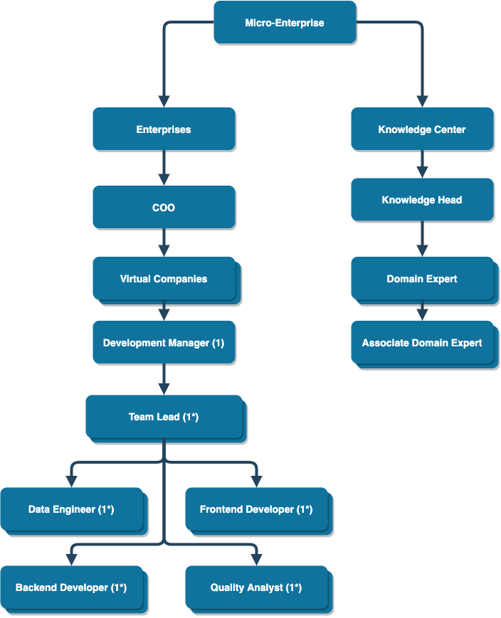

# Micro Enterprise

## About
Micro-Enterprise is an initiative to Orchistrate a complete professional lifecycle for UofT students.

Micro-Enterprise aims to provide consistant and guarenteed internship opportunities for all MCS students but this summer, we aim to pilot this with a small subset of students and development processes.

## Benefits
+ Get an internship by just working for a minimum of 5 hours a week.
+ Get guarenteed internship letters upon successfully completing projects.
+ Learn the art of enterprise-grade software delivery.
+ We're aligning with more and more companies and MNCs everyday, to get this program recognised. With your consent get a chance to be hired by them upon successfully completing projects.
+ Upon successfully completing a project, you would always get a guarenteed internship every semester giving you the ability to rack upto 4 internships every semester and therefore upto 12 internships per year. Thereby catapulting your career for success.

## Apply Now
Application will open between May 1 - May 3. If you are interested in being a part of Micro-Enterprise please add yourself to the mailing list where we will notify you when the applications unfold and other cool updates to propel your career-readiness.

[Join The Mailing List Here](https://forms.gle/ejqpzaqei2kbNXKj9)

### Roles Available
* Technical Development Manager.
* Technical Team Lead.
* Database Developers.
* Backend Developers.
* Quality Analysts.

## Process

## Organizational structure

