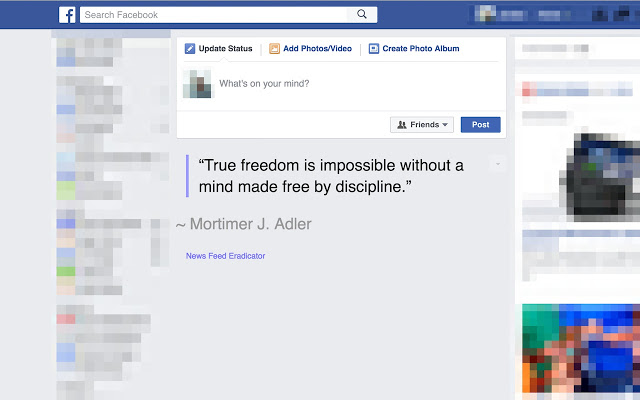

# Resources

The Hacklab creates and curates resources that benefit students academically and professionally.

<ResourcesGrid />

<!-- ## Free Packs for Students -->

## All About Job Applications

<LevelWithButton link="/resources/job-apps" image="https://caccf.ca/wp-content/uploads/2019/04/apply-jobs-eng.jpg" desc="If you want help with your resume, or you're looking to apply for an internship or a full-time job, check out our job application guide." button="Take me there!"/>

## Getting Motivated

It’s a wonderful feeling to be motivated about what you’re learning. Consuming entertaining digital content about your area of education can help you cultivate a sense of wonder.

::: tip Supplementing Course Content
Search these _edu-tainment_ channels for topics in your courses. They may not teach you how to pass a test, but they may help build an understanding of how what you're learning fits in. 
:::

<LevelWithButton link="https://www.youtube.com/user/Computerphile" image="https://yt3.ggpht.com/a/AGF-l792GDOem_pwvOA8KztTpl9Iwe2eOj6vq7LOfQ=s900-c-k-c0xffffffff-no-rj-mo" desc="This Youtube channels explores the domain of Computer Science by interviewing academics and industry professionals. The guests on Computerphile have an enthusiasm for computers that can be contagious!" button="Get Inspired"/>

### [PBS Crash Course](https://www.youtube.com/watch?v=tpIctyqH29Q&list=PL8dPuuaLjXtNlUrzyH5r6jN9ulIgZBpdo)

PBS makes Computer Science education accessible to people of all ages, and this crash course goes into a surprising amount of technical detail.

::: tip CS Education for everyone
I have often used this channel as a guide to provide context for when the content as its taught by professors becomes a bit too technical.
:::

## Markdown

Markdown is a plain text formatting syntax aimed at making writing for the internet easier.

[Markdown Cheatsheet](https://github.com/adam-p/markdown-here/wiki/Markdown-Cheatsheet)

[Interactive Markdown Tutorials](https://www.markdowntutorial.com/lesson/1/)

## Collaboration

### Visual Studio Code Live Share

Live Share enables you to collaboratively edit and debug programming projects with other students in real time. It works regardless what programming languages you're using or app types you're building.

It allows you to instantly (and securely) share your current project, and then as needed, share debugging sessions, terminal instances, localhost web apps, and more!

Install VS Code Live Share [here](https://docs.microsoft.com/en-us/visualstudio/liveshare/#install-visual-studio-live-share)

[Learn more about Live Share](https://docs.microsoft.com/en-us/visualstudio/liveshare/faq)

### [Mindmeister](https://www.mindmeister.com/)

MindMeister is an online mind mapping tool that lets you capture, develop and share ideas visually.

## Focus

### [News Feed Eradicator For Facebook](https://chrome.google.com/webstore/detail/news-feed-eradicator-for/fjcldmjmjhkklehbacihaiopjklihlgg)

Find yourself spending too much time on Facebook? Eradicate distractions by replacing your entire news feed with an inspiring quote!
