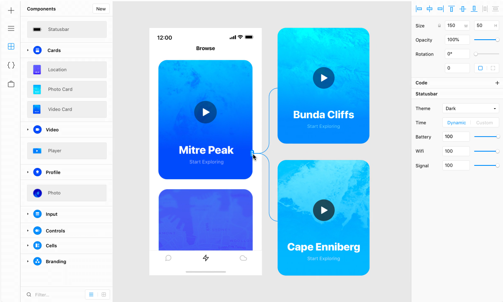

# Design

You may want to use design to explain, to tell a story, to plan, to problem-solve, or to make something look nice. These are all goals you can achieve through designing.

Often, people think design is about the way things look. That’s just one element of design.

## UI Design

UI design stands for “user interface.” The user interface is the graphical layout of an application. It consists of the buttons users click on, the text they read, the images, sliders, text entry fields, and all the rest of the items the user interacts with. This includes screen layout, transitions, interface animations, and every single micro-interaction. Any sort of visual element, interaction, or animation must all be designed.

## Why is UI Design important?

Interactive wireframes and mockups imitate the look and behaviour of the UI. Such prototypes facilitate iterative updates based on stakeholder and user feedback, ensuring the product functions well and meets design goals.

### Tools

#### Figma

<LevelWithButton desc="Figma helps teams create, test, and ship better designs from start to finish." link="https://www.figma.com/"  image="/images/figma.png" button="Start Designing"/>

::: tip Figma for students
Figma provides free collaborative teams for student groups!

Get the discount [here](https://www.figma.com/education/)
:::

## [Framer](https://www.framer.com/)

Framer allows you to create responsive layouts, design realistic prototypes, and bring everything closer to production—all in one place.

## [Coolors](https://coolors.co/)

Create, save and share color palettes in seconds!

