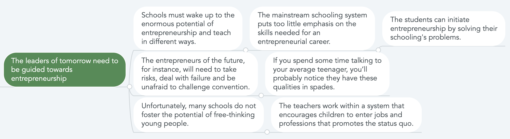

# Resume Help

## Example Student Resumes

A collection of example student resumes from UTM.

  

[**Arsala Bangash**](https://drive.google.com/open?id=1Gf7pInraFqGymEpU5wsFRneXHFIBvdIb)

<iframe src="https://drive.google.com/file/d/1Gf7pInraFqGymEpU5wsFRneXHFIBvdIb/preview" width="480" height="640"></iframe>

[**Jonathan Wang**](https://drive.google.com/open?id=1FdKC6G8z0pscC3Dw3uQKZwpe4QiSlVz_)

<iframe src="https://drive.google.com/file/d/1FdKC6G8z0pscC3Dw3uQKZwpe4QiSlVz_/preview" width="480" height="640"></iframe>

[**Santiago Ordonez**](https://drive.google.com/open?id=1d9wl3FQhnrpChyOxNg7S8Ue7rndPapcJ)

<iframe src="https://drive.google.com/file/d/1d9wl3FQhnrpChyOxNg7S8Ue7rndPapcJ/preview" width="480" height="640"></iframe>

[**Shabaz Badshah**](https://drive.google.com/open?id=1HdadKYzhiGR5X-YqiB4KRhwl5HrYJ8qf)

<iframe src="https://drive.google.com/file/d/1HdadKYzhiGR5X-YqiB4KRhwl5HrYJ8qf/preview" width="480" height="640"></iframe>

[**Nina Ricci Lu**](https://drive.google.com/open?id=15pqPuFUKOC-g_lWwHRj-B6jlWevddRR2)

<iframe src="https://drive.google.com/file/d/15pqPuFUKOC-g_lWwHRj-B6jlWevddRR2/preview" width="480" height="640"></iframe>

## Resume templates

### Canva

<LevelWithButton button="Create Resume!" image="https://external-content.duckduckgo.com/iu/?u=https%3A%2F%2Fyt3.ggpht.com%2F-IlkT956kvCs%2FAAAAAAAAAAI%2FAAAAAAAAAAA%2FyMJj554kN4w%2Fs900-c-k-no-mo-rj-c0xffffff%2Fphoto.jpg" link="https://www.canva.com/templates/search/resumes/" desc="Canva's collection of professionally-designed resumes and it's easy drag and drop interface makes it a winner for creating your resume."/>

### resume.io

<LevelWithButton button="Create Resume!" :imageRight="false" image="https://d33v4339jhl8k0.cloudfront.net/docs/assets/5ba8c7f12c7d3a04dd5ae1a2/images/5c0e8ef82c7d3a31944eef8d/logo.png" link="https://resume.io/" desc="Resume templates that follow the exact ‘resume rules’ employers look for. Effortlessly build a job-worthy resume that gets you hired faster!"/>

[Software Developer Resume Example](https://resume.io/examples/software-developer)

[Programmer Resume Example](https://resume.io/examples/programmer)

[Web Developer Resume Example](https://resume.io/examples/web-developer)

[Data Scientist Resume Example](https://resume.io/examples/data-scientist)

## Getting the Right Experience

_Taken from Cracking the Coding Interview_

### Take the big project classes

If you did worked hard and did well in a non-trivial project for a 200+ level Computer Science course here at UTM, you likely gained expertise that you can talk about in your resume.

Be prepared to answer technical questions related to these projects during the interview. Sounds fair :)

_An example of school projects on a resume_

::: warning Assignments on Github
Please do not publicly upload your assignment code to Github. Your assignment code may be copied, which would result in an academic offense for both parties.
:::

### Get an internship

_"I need experience to get experience"_ **is real**

Check out where you can apply [here](/resources/internship-apps)

Build your professional network to leverage personal recommendations when looking for jobs. Join our [LinkedIn Community](https://www.linkedin.com/groups/8798043/) to connect with UTM students in the industry.

### Start something

Starting self-initiated projects are an excellent way to acquire the skills that go into building and maintaining real world systems.

The university workload doesn't make this easy, since these projects require time and effort to realize, but we encourage students to persevere and pursue this path.

## Google's Guidance

**Your resume is the first piece of information employers see about you. Here’s how to highlight your achievements:**

- Align your skills and experience with the internship or job description

- Be specific about projects you’ve worked on or managed. What was the outcome? How did you measure success?

- If you've had a leadership role in a volunteer organization or at a part-time job, tell us about it. How big was the team? What was the scope of your work?

- Include your GPA, as well as school-related projects or coursework that demonstrate relevant skills and knowledge **as you see fit**

- Keep it short: Aim for one page. If there’s additional information we need during the hiring process, (like a portfolio), your recruiter will work with you to collect it

<iframe width="560" height="315" src="https://www.youtube.com/embed/BYUy1yvjHxE" frameborder="0" allow="accelerometer; autoplay; encrypted-media; gyroscope; picture-in-picture" allowfullscreen></iframe>

## Christina Ng's Guidance

[**Christina Ng**](https://medium.com/@christinang89) has written the resume guidance section for the [Tech Interview Handbook](https://yangshun.github.io/tech-interview-handbook/introduction).

Read what she has to say [here](https://yangshun.github.io/tech-interview-handbook/resume/)

## Next Steps: Applications

When you're ready to apply and show off your resume, check out our [**guide**](/resources/internship-apps) on where to apply.
